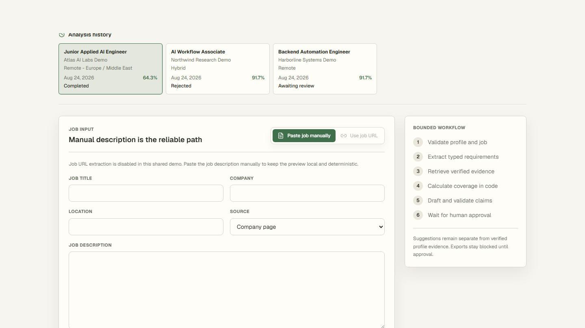
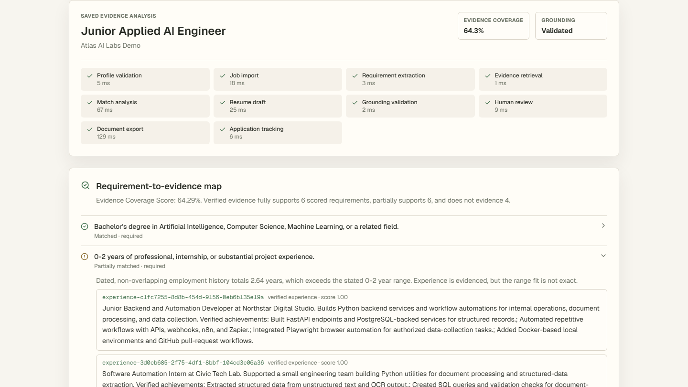
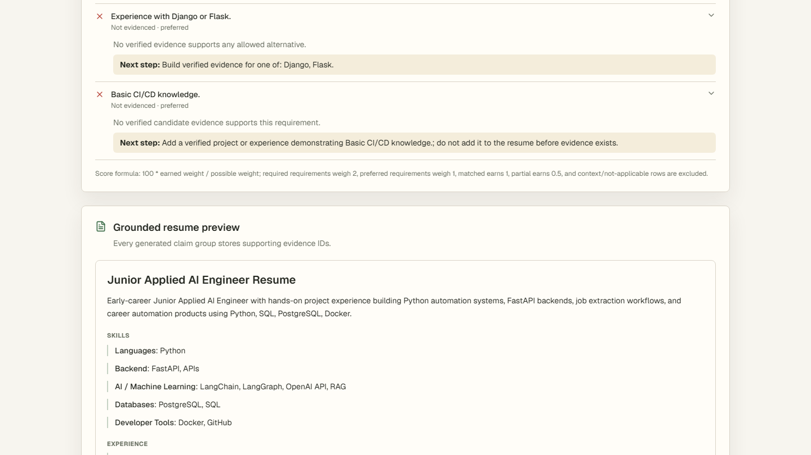
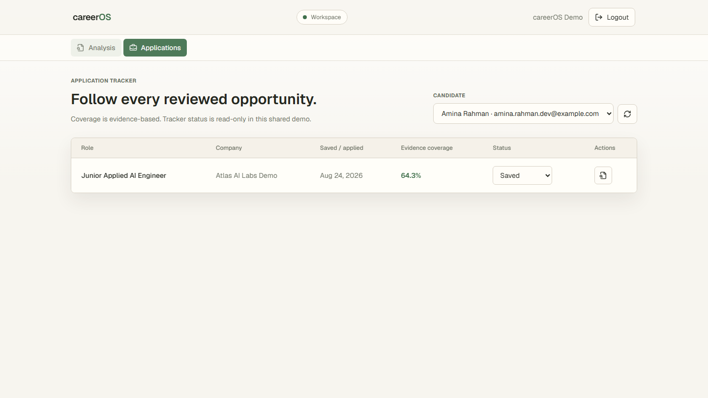
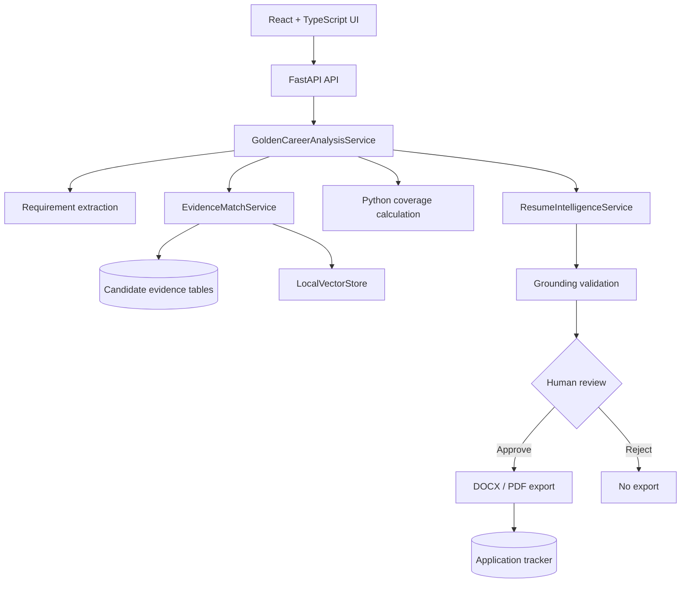

# CareerOS - Evidence-Grounded AI Career Analysis Platform


CareerOS compares typed job requirements with verified candidate evidence, calculates a
transparent coverage score, blocks unsupported resume claims, and requires human approval
before DOCX or PDF export. Its deterministic demo path runs without a paid provider.

## Demo media

These captures use the production frontend build, deterministic analysis, and the fictional Amina
Rahman demo profile.

| Analysis workspace | Requirement evidence |
| --- | --- |
|  |  |
| Grounded resume | Application tracking |
|  |  |

A 90-120 second demo recording is still required; capture guidance lives in
[`docs/images/README.md`](docs/images/README.md).

Temporary `trycloudflare.com` addresses are never used as permanent demo links.

## Why this project

Many resume generators optimize language without showing whether the candidate can support the
resulting claims. CareerOS keeps candidate-owned records as the source of truth, retrieves cited
evidence for each requirement, calculates fit in code, validates every draft claim against stable
evidence IDs, and stops at a human review gate. Missing evidence stays visible instead of being
rewritten as experience.

## Key features

- Structured job-requirement extraction with required, preferred, and context-only classes
- Candidate evidence knowledge base with stable, candidate-owned evidence IDs
- Deterministic lexical and vector retrieval with requirement-level citations
- Code-calculated Evidence Coverage Score
- Full, partial, not-evidenced, and not-applicable classifications
- Unsupported-claim rejection and grounding validation
- Human approval or rejection before export
- One-page DOCX and PDF generation with working hyperlinks
- Application tracking and persisted analysis history
- Review-first PDF/DOCX resume import
- Safe shared-demo mode with profile and tracker mutations disabled

## Architecture



These are bounded services, not autonomous agents. Candidate database rows remain the source of
truth; the local vector index is rebuilt from them for retrieval. See
[`docs/ARCHITECTURE.md`](docs/ARCHITECTURE.md) for component and persistence details.

## Golden Career Analysis Flow

1. Validate the authenticated candidate and manual job input.
2. Extract typed required, preferred, and context-only requirements.
3. Retrieve verified candidate evidence with stable IDs and transparent scores.
4. Calculate weighted evidence coverage in Python.
5. Draft a resume and validate every claim against cited evidence.
6. Wait for explicit human approval or rejection.
7. On approval, export DOCX/PDF and create the application record.

## Evidence Coverage Score

The score is code-calculated and inspectable:

```text
coverage = 100 * earned_weight / possible_weight
required weight = 2
preferred weight = 1
full evidence = 1
partial evidence = 0.5
```

Context-only and not-applicable rows are excluded. This is an evidence coverage measure, not an
ATS score, hiring probability, or promise of recruiter interest. It is designed to resist inflated
keyword matches.

### Deterministic demonstration fixture

The canonical Applied AI Engineer fixture produces:

| Classification | Count |
| --- | ---: |
| Total requirements | 16 |
| Fully supported | 6 |
| Partially supported | 6 |
| Not evidenced | 4 |
| Evidence coverage | **64.29%** |

This is a reproducible local fixture, not a production benchmark or customer outcome. Evaluation
definitions and negative controls are documented in [`docs/EVALUATION.md`](docs/EVALUATION.md).

## Repository structure

```text
backend/
  alembic/                 Database migrations
  app/api/                 FastAPI routes and request boundaries
  app/features/            Analysis, retrieval, grounding, import, and export logic
  app/services/            Bounded workflow orchestration
  evals/fixtures/          Deterministic recruiter-demo fixtures
  tests/                   Unit, API, integration, and evaluation tests
frontend/
  src/components/          React workflow and application tracker
  src/lib/                 Typed API client
  tests/                   Playwright browser journeys
docs/                      Architecture, evaluation, demo, preview, and CI runbooks
.github/workflows/ci.yml   Backend, frontend, and browser CI
Dockerfile                 Backend and production frontend build targets
docker-compose.yml         PostgreSQL, FastAPI, and Nginx-served React stack
```

## Local setup

### Backend

Python 3.12 and PostgreSQL are required for normal development.

```powershell
git clone https://github.com/7-ARK/careerOS.git
cd careerOS
Copy-Item .env.example backend/.env

cd backend
python -m venv .venv
.\.venv\Scripts\Activate.ps1
pip install -e ".[dev]"
python -m alembic upgrade head
python -m scripts.seed_candidate
python -m uvicorn app.main:app --reload --host 127.0.0.1 --port 8000
```

Set `DATABASE_URL` in the ignored `backend/.env` before running Alembic. The checked-in example uses
local PostgreSQL and deterministic analysis defaults. A paid provider key is optional.

### Frontend

```powershell
cd frontend
npm install
npm run dev
```

Open `http://127.0.0.1:3000`. Vite proxies relative `/api` requests to the loopback backend.

### Docker Compose

```powershell
Copy-Item .env.example .env
docker compose up --build -d
docker compose exec backend python -m scripts.seed_candidate
```

Open the UI at `http://localhost:3000`, API docs at `http://localhost:8000/docs`, and health check at
`http://localhost:8000/health`. Reset the local stack with `docker compose down -v`.

The synthetic demo login after seeding is `demo@careeros.local` / `password123`. These are fixture
credentials only and must not be reused for a deployment.

## Verification

```powershell
cd backend
.\.venv\Scripts\python.exe -m pytest -q
.\.venv\Scripts\python.exe -m pytest tests\evals -q
.\.venv\Scripts\ruff.exe check .
.\.venv\Scripts\python.exe -m compileall -q .
.\.venv\Scripts\python.exe -m alembic check

cd ..\frontend
npm.cmd run lint
npm.cmd run build
npx.cmd playwright test
```

Playwright owns a disposable SQLite database and starts its own loopback servers. Migration checks
should use a disposable or dedicated development database. The CI stages and local equivalents are
explained in [`docs/CI.md`](docs/CI.md).

## Safety and grounding

- Stable evidence IDs tie each generated claim to candidate-owned records.
- Requirement-level citations expose the exact evidence and retrieval scores used.
- Unknown IDs, uncited claims, or unsupported statements block approval.
- Documents do not exist until the reviewer approves a grounded draft.
- Shared preview mode disables live providers, profile writes, resume import, URL extraction, and
  tracker mutation.
- Deterministic demo mode requires no paid provider or external data source.

## Known limitations

- Deterministic feature-hash embeddings are simpler than production embedding systems.
- Resume import is heuristic, review-first, and disabled in the shared demo.
- URL extraction is best-effort; manual job text is the supported demo path.
- Shared preview mode disables profile editing and tracker mutation.
- Generated documents use local filesystem storage.
- PDF exports are not claimed to be PDF/UA certified.
- This repository makes no claim of real customers, production traffic, hiring outcomes, or
  independent verification of candidate facts.

The full list is maintained in [`docs/KNOWN_LIMITATIONS.md`](docs/KNOWN_LIMITATIONS.md).

## What this project demonstrates

- Applied AI system design and RAG-style evidence retrieval
- Structured model boundaries with deterministic fallback behavior
- Grounding, citation, and hallucination-prevention controls
- Human-in-the-loop product design
- FastAPI, SQLAlchemy, PostgreSQL, and Alembic backend engineering
- React and TypeScript workflow integration
- Document generation, automated evaluation, and browser acceptance testing

## Author

**Ahmed Raza**<br>
Applied AI / AI Agent Engineer

- [GitHub](https://github.com/7-ARK)
- [LinkedIn](https://www.linkedin.com/in/ahmed-raza-kahoot/)

No repository license file has been added; package metadata currently marks the project as
proprietary. Ahmed should choose a license before inviting third-party reuse.
