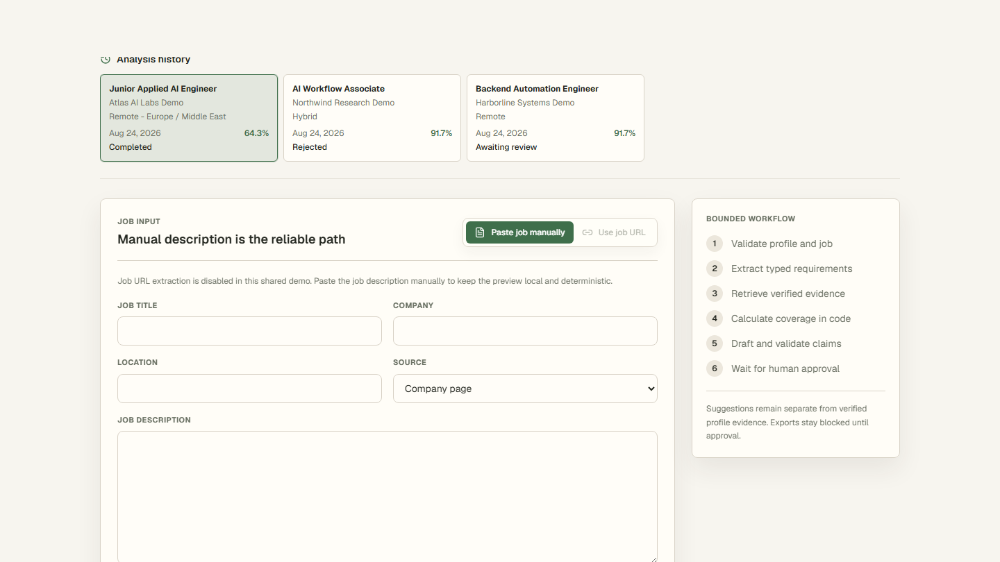
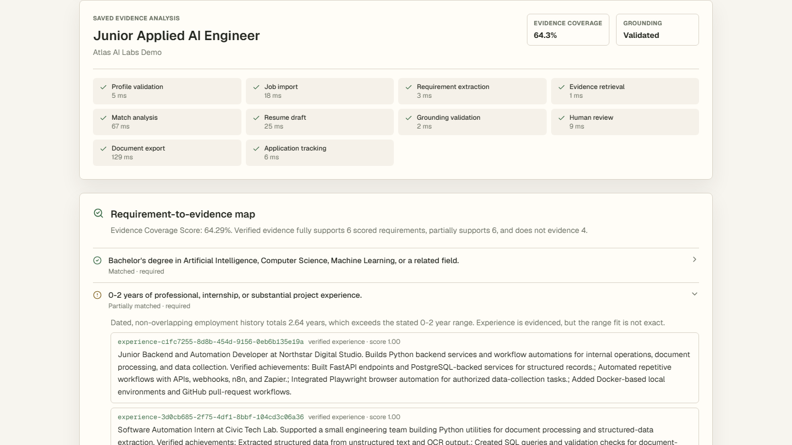
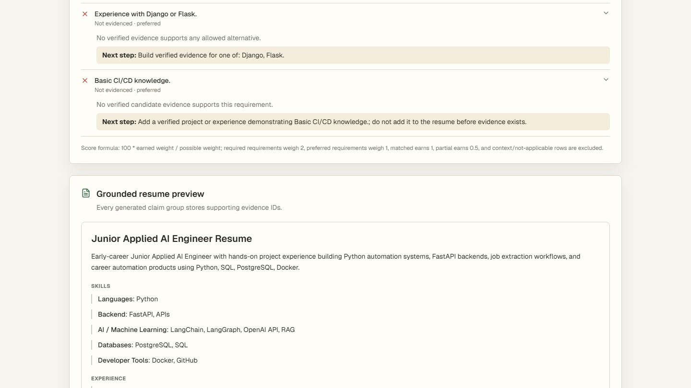
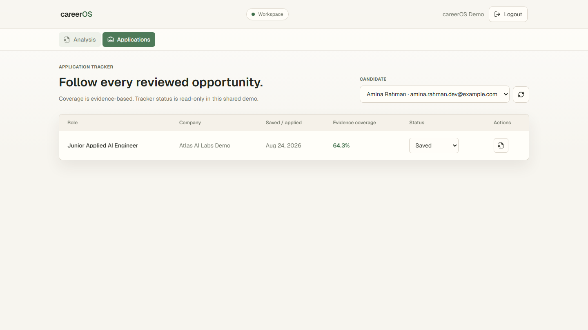
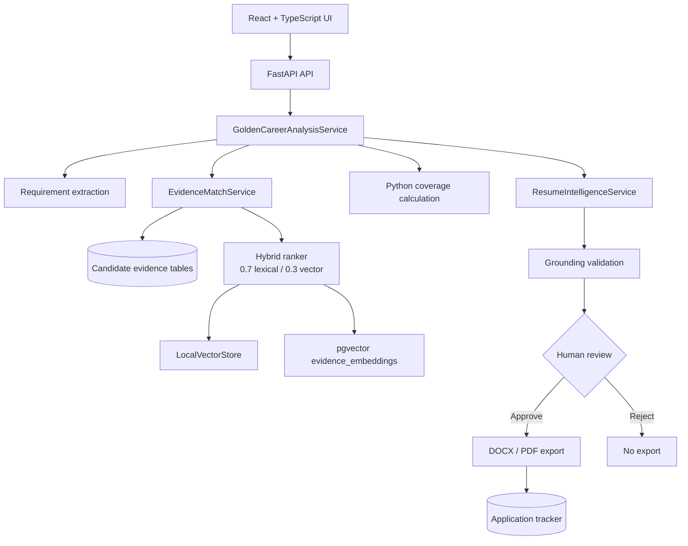

# CareerOS - Evidence-Grounded AI Career Analysis Platform


CareerOS compares typed job requirements with verified candidate evidence, calculates a
transparent coverage score, blocks unsupported resume claims, and requires human approval
before DOCX or PDF export. Its deterministic demo path runs without a paid provider.

## Product Demo

[](https://youtu.be/4OYOZlyqrLA)

[Watch the CareerOS v1.0 product demo on YouTube](https://youtu.be/4OYOZlyqrLA). This concise
walkthrough covers the evidence-analysis pipeline, requirement-level citations, grounding
validation, human approval, resume export, and application tracking.

## Product Screenshots

These captures use the production frontend build, deterministic analysis, and the fictional Amina
Rahman demo profile.

| Requirement evidence | Grounded resume |
| --- | --- |
|  |  |

### Application tracking



## Why this project

Many resume generators optimize language without showing whether the candidate can support the
resulting claims. CareerOS keeps candidate-owned records as the source of truth, retrieves cited
evidence for each requirement, calculates fit in code, validates every draft claim against stable
evidence IDs, and stops at a human review gate. Missing evidence stays visible instead of being
rewritten as experience.

## Key features

- Structured job-requirement extraction with required, preferred, and context-only classes
- Candidate evidence knowledge base with stable, candidate-owned evidence IDs
- Hybrid lexical and vector retrieval with requirement-level citations, deterministic by default
- Code-calculated Evidence Coverage Score
- Full, partial, not-evidenced, and not-applicable classifications
- Unsupported-claim rejection and grounding validation
- Human approval or rejection before export
- One-page DOCX and PDF generation with working hyperlinks
- Application tracking and persisted analysis history
- Review-first PDF/DOCX resume import
- Safe shared-demo mode with profile and tracker mutations disabled

## Architecture


```mermaid
flowchart TD
    UI["React + TypeScript UI"] --> API["FastAPI API"]
    API --> ORCH["GoldenCareerAnalysisService"]
    ORCH --> REQ["Requirement extraction"]
    ORCH --> RET["EvidenceMatchService"]
    RET --> KB[("Candidate evidence tables")]
    RET --> RANK["Hybrid ranker\n0.7 lexical / 0.3 vector"]
    RANK --> LOCAL["LocalVectorStore"]
    RANK --> PG["pgvector evidence_embeddings"]
    ORCH --> SCORE["Python coverage calculation"]
    ORCH --> DRAFT["ResumeIntelligenceService"]
    DRAFT --> GROUND["Grounding validation"]
    GROUND --> REVIEW{"Human review"}
    REVIEW -->|Approve| DOCS["DOCX / PDF export"]
    REVIEW -->|Reject| STOP["No export"]
    DOCS --> TRACK[("Application tracker")]
```

These are bounded services, not autonomous agents. Candidate database rows remain the source of
truth. The default local index is rebuilt from those rows; `RAG_VECTOR_STORE=pgvector` persists
embeddings and still ranks them in Python. See
[`docs/ARCHITECTURE.md`](docs/ARCHITECTURE.md) for component and persistence details.

## Evidence RAG / retrieval

CareerOS retrieves candidate-owned evidence for each job requirement and cites the records it
uses. It does not treat a nearby sentence as proof of a tool the candidate never recorded.

Hybrid ranking is **0.7 lexical / 0.3 vector**: `min(1, 0.7 * lexical + 0.3 * vector)`. There is
no reranker and no vector-only product path. Lexical overlap keeps exact tool names in front. The
vector term can raise a paraphrase. It does not replace the lexical score.

The system must not invent experience. AWS is not treated as Google Cloud, and a certification or
coursework note is not rewritten as production deployment on either cloud. Explicit phrase rules
for AWS, Kubernetes, and CI/CD require the name or an accepted alias in the candidate's own
evidence. Hybrid similarity does not override those rules. Unsupported tools stay `not_evidenced`.

`RAG_VECTOR_STORE=local` (the default, and the CI path) rebuilds an in-memory index from PostgreSQL.
`RAG_VECTOR_STORE=pgvector` stores vectors in `evidence_embeddings` and still scores them in
Python. Every read and write is limited to one `candidate_profile_id`. The cache key is evidence
id, embedding model, and content hash, so unchanged text is not embedded again.

`RAG_EMBEDDING_PROVIDER=deterministic` (the default) uses offline `feature-hash-v1` vectors. Tests
and CI stay on that provider. `RAG_EMBEDDING_PROVIDER=openai` calls `text-embedding-3-small` and
fails if `OPENAI_API_KEY` is missing. It does not fall back silently. Preview mode forces the
deterministic provider and the local store. Keys belong only in an ignored env file or the shell.
They are never printed and never committed.

### Benchmark

Frozen 24-case curated benchmark on the Amina Rahman demo corpus: 8 exact, 6 paraphrase, 5
near-miss, and 5 unsupported. Recall@1 and MRR use the 14 graded cases that have relevant evidence
(exact and paraphrase). Near-miss and unsupported cases have no relevant chunk, so they are scored
only as status false positives. Figures below are the recorded run in
[`backend/evals/results/retrieval_report.md`](backend/evals/results/retrieval_report.md) and
[`backend/evals/results/results.json`](backend/evals/results/results.json). MRR is that report's
four-decimal rounding.

Semantic retrieval improved paraphrase ranking. Status labels are still gated by lexical rules.
Unsupported and near-miss false positives stayed zero.

| Metric | Lexical | Feature-hash hybrid | OpenAI semantic hybrid |
| --- | ---: | ---: | ---: |
| Paraphrase Recall@1 | 0/6 | 1/6 | 5/6 |
| Overall Recall@1 (n=14 graded) | 8/14 | 9/14 | 13/14 |
| MRR (n=14) | 0.7679 | 0.7881 | 0.9643 |
| Overall status accuracy | 19/24 | 19/24 | 19/24 |
| Unsupported false positives | 0/5 | 0/5 | 0/5 |
| Near-miss false positives | 0/5 | 0/5 | 0/5 |

Paraphrase status accuracy stayed 1/6 in all three modes. OpenAI `text-embedding-3-small` moved
paraphrase Recall@1 from 0/6 to 5/6. The lexical status rules still labeled most of those hits
`partially_matched` or `not_evidenced`.

The OpenAI arm made 25 embedding requests and reported 961 prompt tokens. The approximate
list-price cost is 0.00001922 USD. That estimate is not an invoice.

After status-gate diagnosis, the product status gate was **left unchanged**. Semantic ranking
improved paraphrase Recall@1, and status labels still follow the lexical rules. A vector bar low
enough to mark the remaining zero-lexical paraphrase hit as matched would also admit near-miss and
unsupported neighbors on this frozen run. AWS, Kubernetes, and CI/CD stay on explicit phrase rules
that do not read the hybrid score. The diagnosis is recorded in
[`backend/evals/results/status_gate_diagnosis.md`](backend/evals/results/status_gate_diagnosis.md)
and is not implemented in product code.

From `backend/`:

```powershell
python -m scripts.retrieval_eval
```

Lexical and feature-hash arms always run. The OpenAI arm runs only when `OPENAI_API_KEY` is set,
reuses vectors under `evals/cache/` (gitignored), and does not print the key. The command writes
`evals/results/results.json` and `evals/results/retrieval_report.md`. The follow-up diagnosis reads
that JSON only and does not call OpenAI:

```powershell
python -m scripts.status_gate_diagnosis
```

## Design Decisions

- **pgvector, because CareerOS already uses PostgreSQL.** Persistent embeddings live in
  `evidence_embeddings` next to the candidate rows. A second vector database was not added.
- **Deterministic embeddings for CI and tests.** `feature-hash-v1` keeps retrieval checks free,
  offline, and repeatable. GitHub Actions does not call a paid embedding API.
- **OpenAI `text-embedding-3-small` for real semantic mode.** One small embedding model is the
  optional live path. A missing `OPENAI_API_KEY` fails closed instead of silently using local vectors.
- **Hybrid retrieval instead of vector-only.** The 0.7 / 0.3 mix keeps exact names grounded and
  still lets a paraphrase move up. Vector similarity alone does not decide the ranking.
- **Candidate-level isolation and a content-hash embedding cache.** Queries and writes filter on
  `candidate_profile_id`. Unchanged evidence text is reused by content hash, model, and evidence id.
- **Conservative grounding over aggressive matching.** Status still requires lexical support or an
  explicit alias. After the frozen-benchmark diagnosis, that gate was left unchanged so a better
  rank cannot invent a supported claim.

## Evolution

```text
In-memory deterministic retrieval
+ persistent pgvector storage
+ hybrid retrieval integration
+ real semantic embeddings
+ benchmarked retrieval/evidence grounding
```

That is the retrieval stack as it stands. The product status gate was left unchanged.

## Golden Career Analysis Flow

1. Validate the authenticated candidate and manual job input.
2. Extract typed required, preferred, and context-only requirements.
3. Retrieve verified candidate evidence with stable IDs and transparent scores.
4. Calculate weighted evidence coverage in Python.
5. Draft a resume and validate every claim against cited evidence.
6. Wait for explicit human approval or rejection.
7. On approval, export DOCX/PDF and create the application record.

## Evidence Coverage Score

The score is code-calculated and inspectable:

```text
coverage = 100 * earned_weight / possible_weight
required weight = 2
preferred weight = 1
full evidence = 1
partial evidence = 0.5
```

Context-only and not-applicable rows are excluded. This is an evidence coverage measure, not an
ATS score, hiring probability, or promise of recruiter interest. It is designed to resist inflated
keyword matches.

### Deterministic demonstration fixture

The canonical Applied AI Engineer fixture produces:

| Classification | Count |
| --- | ---: |
| Total requirements | 16 |
| Fully supported | 6 |
| Partially supported | 6 |
| Not evidenced | 4 |
| Evidence coverage | **64.29%** |

This is a reproducible local fixture, not a production benchmark or customer outcome. Evaluation
definitions and negative controls are documented in [`docs/EVALUATION.md`](docs/EVALUATION.md).

## Repository structure

```text
backend/
  alembic/                 Database migrations
  app/api/                 FastAPI routes and request boundaries
  app/features/            Analysis, retrieval, grounding, import, and export logic
  app/services/            Bounded workflow orchestration
  evals/fixtures/          Deterministic recruiter-demo fixtures
  evals/results/           Recorded retrieval benchmark and status-gate diagnosis
  scripts/                 Seed, retrieval eval, and optional embedding smoke
  tests/                   Unit, API, integration, and evaluation tests
frontend/
  src/components/          React workflow and application tracker
  src/lib/                 Typed API client
  tests/                   Playwright browser journeys
docs/                      Architecture, evaluation, demo, preview, and CI runbooks
.github/workflows/ci.yml   Backend, frontend, and browser CI
Dockerfile                 Backend and production frontend build targets
docker-compose.yml         PostgreSQL, FastAPI, and Nginx-served React stack
```

## Local setup

### Backend

Python 3.12 and PostgreSQL are required for normal development.

```powershell
git clone https://github.com/7-ARK/careerOS.git
cd careerOS
Copy-Item .env.example backend/.env

cd backend
python -m venv .venv
.\.venv\Scripts\Activate.ps1
pip install -e ".[dev]"
python -m alembic upgrade head
python -m scripts.seed_candidate
python -m uvicorn app.main:app --reload --host 127.0.0.1 --port 8000
```

Set `DATABASE_URL` in the ignored `backend/.env` before running Alembic. The checked-in example uses
local PostgreSQL and deterministic analysis defaults. A paid provider key is optional. Never commit
or paste a real `OPENAI_API_KEY`. The app does not print it.

#### Retrieval modes

Normal development, tests, and CI stay local and deterministic. No API key and no network:

```text
RAG_EMBEDDING_PROVIDER=deterministic
RAG_VECTOR_STORE=local
```

Optional semantic mode is opt-in. Put the key only in the ignored `backend/.env` or the shell:

```text
RAG_EMBEDDING_PROVIDER=openai
RAG_EMBEDDING_MODEL=text-embedding-3-small
OPENAI_API_KEY=<your key>
RAG_VECTOR_STORE=local
```

`RAG_VECTOR_STORE=pgvector` is the optional persistent store. It needs PostgreSQL with pgvector and
`python -m alembic upgrade head`. Leave `RAG_EMBEDDING_DIMENSIONS` unset unless you intend to
override the model default. `CAREEROS_PREVIEW_MODE=true` forces deterministic embeddings and the
local store. A live OpenAI call with a missing key fails. It does not switch back to feature-hash
vectors.

### Frontend

```powershell
cd frontend
npm install
npm run dev
```

Open `http://127.0.0.1:3000`. Vite proxies relative `/api` requests to the loopback backend.

### Docker Compose

```powershell
Copy-Item .env.example .env
docker compose up --build -d
docker compose exec backend python -m scripts.seed_candidate
```

Open the UI at `http://localhost:3000`, API docs at `http://localhost:8000/docs`, and health check at
`http://localhost:8000/health`. Reset the local stack with `docker compose down -v`.

The synthetic demo login after seeding is `demo@careeros.local` / `password123`. These are fixture
credentials only and must not be reused for a deployment.

## Verification

```powershell
cd backend
.\.venv\Scripts\python.exe -m pytest -q
.\.venv\Scripts\python.exe -m pytest tests\evals -q
.\.venv\Scripts\ruff.exe check .
.\.venv\Scripts\python.exe -m compileall -q .
.\.venv\Scripts\python.exe -m alembic check

cd ..\frontend
npm.cmd run lint
npm.cmd run build
npx.cmd playwright test
```

Playwright owns a disposable SQLite database and starts its own loopback servers. Migration checks
should use a disposable or dedicated development database. The CI stages and local equivalents are
explained in [`docs/CI.md`](docs/CI.md). The retrieval benchmark is separate from pytest. Run
`python -m scripts.retrieval_eval` from `backend/` as described under
[Evidence RAG / retrieval](#evidence-rag--retrieval).

## Safety and grounding

- Stable evidence IDs tie each generated claim to candidate-owned records.
- Requirement-level citations expose the exact evidence and retrieval scores used.
- Unknown IDs, uncited claims, or unsupported statements block approval.
- Documents do not exist until the reviewer approves a grounded draft.
- Shared preview mode disables live providers, profile writes, resume import, URL extraction, and
  tracker mutation.
- Deterministic demo mode requires no paid provider or external data source.

## Known limitations

- Default and CI retrieval uses deterministic feature-hash embeddings. Live OpenAI embeddings require `RAG_EMBEDDING_PROVIDER=openai` and `OPENAI_API_KEY`; a missing key fails. Hybrid weights stay 0.7 / 0.3. After diagnosis, the product status gate was left unchanged. On the 24-case benchmark, status accuracy stayed 19/24 in every mode.
- Resume import is heuristic, review-first, and disabled in the shared demo.
- URL extraction is best-effort; manual job text is the supported demo path.
- Shared preview mode disables profile editing and tracker mutation.
- Generated documents use local filesystem storage.
- PDF exports are not claimed to be PDF/UA certified.
- This repository makes no claim of real customers, production traffic, hiring outcomes, or
  independent verification of candidate facts.

The full list is maintained in [`docs/KNOWN_LIMITATIONS.md`](docs/KNOWN_LIMITATIONS.md).

## What this project demonstrates

- Applied AI system design and RAG-style evidence retrieval
- Structured model boundaries with deterministic fallback behavior
- Grounding, citation, and hallucination-prevention controls
- Human-in-the-loop product design
- FastAPI, SQLAlchemy, PostgreSQL, and Alembic backend engineering
- React and TypeScript workflow integration
- Document generation, automated evaluation, and browser acceptance testing

## Author

**Ahmed Raza**<br>
Applied AI / AI Agent Engineer

- [GitHub](https://github.com/7-ARK)
- [LinkedIn](https://www.linkedin.com/in/ahmed-raza-applied-ai/)

No repository license file has been added; package metadata currently marks the project as
proprietary. Ahmed should choose a license before inviting third-party reuse.
