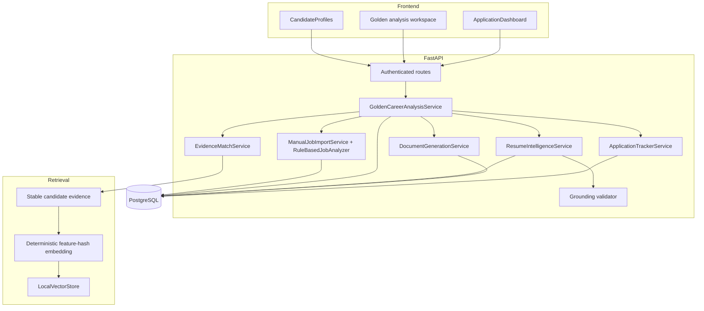

# Architecture

## System boundary

careerOS implements one bounded workflow. React is the operator surface, FastAPI owns authentication and validation, SQLAlchemy/PostgreSQL stores durable source records, and local document generators produce approved files. No autonomous agent chooses actions or modifies candidate evidence.

## Golden Career Analysis Flow

1. Validate the authenticated candidate profile.
2. Persist the original manual job description and deterministic typed analysis.
3. Project the analysis into required, preferred, and context-only requirements.
4. Convert candidate rows into verified chunks with stable IDs (`skill-{uuid}`, `project-{uuid}`, and similar).
5. Rebuild one local vector index and retrieve top-k evidence with metadata filters, lexical score, vector score, and a combined score.
6. Classify each requirement and calculate coverage in code.
7. Reuse `ResumeIntelligenceService` to produce a draft and attach stable evidence IDs to each claim group.
8. Run grounding validation and create a Saved tracker record.
9. Persist `awaiting_review`; generate no files.
10. On explicit approval, validate grounding again and generate DOCX/PDF through the existing document service.
11. Attach the preferred generated document to the application record.

## Components



## Retrieval and grounding

Candidate tables remain the source of truth. The vector index is ephemeral and rebuilt from those rows, avoiding a second mutable knowledge store. The default `feature-hash-v1` provider creates stable local vectors; `RAG_EMBEDDING_PROVIDER=openai` enables the one optional remote adapter when a key is present. Missing credentials fall back to deterministic retrieval.

AI suggestions are never written into candidate evidence. Match citations include evidence ID, category, text, verification state, and retrieval scores. A draft's `grounding_manifest` lists the evidence IDs for every summary, skill, experience, project, education, and certification claim group. Approval fails if a claim is unsupported or cites unknown evidence.

## Score

```text
Evidence Coverage Score = 100 * earned weight / possible weight
required weight = 2
preferred weight = 1
matched value = 1
partial value = 0.5
context and not-applicable rows are excluded
```

The LLM cannot set this score.

## Persistence

Alembic revision `e18c8cbf35a5` establishes the recruiter-ready schema. Follow-up revisions deduplicate candidate owner/email identities and expand the tracker lifecycle. Each run stores stage status, latency, provider/model, token usage, estimated cost, failures, requirements, matches, and review notes.

Resume import is intentionally outside persistence until review. An authenticated PDF/DOCX upload is bounded to 5 MB, parsed in memory, and returned as a structured preview. The source file is not written to disk and the user must submit the normal candidate form before any candidate evidence changes.

## Security and privacy

- JWT-authenticated ownership checks guard candidate, analysis, application, and document access.
- Job text is bounded to 50,000 characters; URLs and emails are validated by Pydantic.
- Resume-import types, signatures, extracted text size, and encrypted PDFs are validated before local parsing.
- Request telemetry logs method/path/status/request ID/latency, never bodies, API keys, full resumes, or contact details.
- Providers use bounded timeout and retry settings.
- Export filenames and types are controlled by the existing local document generator.

## Runtime and deployment baseline

The root `Dockerfile` has two named targets. The `backend` target installs the Python runtime,
applies Alembic migrations, and starts FastAPI. The `frontend` target compiles the React app and
serves static assets through Nginx, whose `/api` location forwards requests to the backend service.
`docker-compose.yml` adds PostgreSQL, health-gates backend startup on the database, and stores
database and generated-document data in named local volumes.

This is a reproducible local/container baseline, not a claim of high availability. A production
deployment still needs managed secrets, private object storage, TLS termination, backups,
monitoring, retention controls, and a deliberate database migration procedure.

## Continuous integration

`.github/workflows/ci.yml` separates backend, frontend, and Chromium browser checks. All test paths
use deterministic analysis; the browser launcher owns a disposable SQLite database and disables
paid resume intelligence. See [`CI.md`](CI.md) for the commands and failure boundaries.
